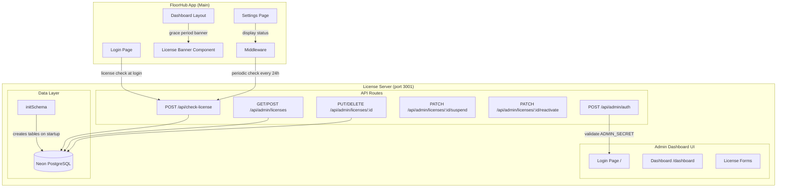

# Design Document: License Management

## Overview

This feature enhances the existing FloorHub License Server (`license-server/`) with full license lifecycle management. The current system is a minimal domain allowlist with no expiration, no admin UI, and a broken `initSchema` export. The enhanced system introduces:

- Proper license records with expiration dates, license keys, status tracking, and grace periods
- An admin dashboard built into the license server (simple HTML/Tailwind, no shadcn/ui) for managing licenses
- Enhanced license check API returning detailed status information
- License validation at login and periodic revalidation via middleware in the main FloorHub app
- Heartbeat/usage tracking so admins can monitor active deployments
- A license status indicator on the FloorHub settings page (owner-only)

The license server remains a separate Next.js app on port 3001 with its own Neon PostgreSQL database. The main FloorHub app only contains client-side license checking logic (login check, middleware check, settings status indicator).

## Architecture



### Key Design Decisions

1. **Admin dashboard in license server**: The admin UI lives inside the license server app, not the FloorHub app. This keeps license management self-contained and avoids coupling.

2. **Simple HTML/Tailwind for admin UI**: The license server doesn't use shadcn/ui. Admin pages use plain HTML elements styled with Tailwind CSS, keeping dependencies minimal.

3. **Cookie-based admin sessions**: Admin auth uses a signed cookie containing the admin secret hash, verified on each request. No JWT library needed — just a simple HMAC comparison.

4. **Fail-open for FloorHub license checks**: If the license server is unreachable during login or middleware checks, FloorHub allows access. This prevents license server downtime from blocking all users. Registration remains fail-closed (existing behavior).

5. **24-hour cached check via cookies**: The middleware stores `license_checked_at` in a cookie to avoid hitting the license server on every request. Only rechecks when the cookie is missing or stale (>24h).

6. **Grace period per-license**: Each license record has its own `grace_period_days` (default 7), allowing flexible per-customer grace periods.

## Components and Interfaces

### License Server Components

#### 1. `license-server/lib/db.ts` — Database Layer
- Export `initSchema()` that creates the `licenses` table (replacing `licensed_domains`)
- Migrate existing `licensed_domains` rows into the new `licenses` table
- Export `sql` tagged template and `generateId()` (existing)

#### 2. `license-server/lib/auth.ts` — Admin Auth Utilities
- `createAdminSession(secret: string): string | null` — validates the secret against `ADMIN_SECRET` env var, returns a signed session token (HMAC of timestamp + secret)
- `verifyAdminSession(cookie: string): boolean` — verifies the session cookie is valid
- `ADMIN_COOKIE_NAME = 'license_admin_session'`

#### 3. `license-server/app/api/check-license/route.ts` — Enhanced License Check
- `POST /api/check-license` — accepts `{ domain, active_users? }`, returns detailed license status
- Handles active, grace period, expired, suspended, not_found states
- Updates `last_heartbeat_at` and `active_users` when provided

#### 4. `license-server/app/api/admin/licenses/route.ts` — License CRUD
- `GET /api/admin/licenses` — list all licenses (requires admin secret)
- `POST /api/admin/licenses` — create new license (requires admin secret)

#### 5. `license-server/app/api/admin/licenses/[id]/route.ts` — Single License Operations
- `PUT /api/admin/licenses/:id` — update license fields
- `DELETE /api/admin/licenses/:id` — delete license

#### 6. `license-server/app/api/admin/licenses/[id]/suspend/route.ts`
- `PATCH /api/admin/licenses/:id/suspend` — set status to suspended

#### 7. `license-server/app/api/admin/licenses/[id]/reactivate/route.ts`
- `PATCH /api/admin/licenses/:id/reactivate` — set status to active

#### 8. `license-server/app/api/admin/auth/route.ts` — Admin Login API
- `POST /api/admin/auth` — validates admin secret, sets session cookie
- `DELETE /api/admin/auth` — clears session cookie (logout)

#### 9. `license-server/app/page.tsx` — Admin Login Page
- Simple form with a single "Admin Secret" password field
- Posts to `/api/admin/auth`, redirects to `/dashboard` on success

#### 10. `license-server/app/dashboard/page.tsx` — Admin Dashboard
- Server component that checks admin session cookie
- Renders license table with all records
- Search/filter by domain or status
- Action buttons for create, edit, suspend, reactivate, delete

#### 11. `license-server/app/dashboard/layout.tsx` — Dashboard Layout
- Verifies admin session, redirects to `/` if invalid
- Simple nav bar with "Licenses" and "Logout" links

#### 12. `license-server/middleware.ts` — Admin Route Protection
- Protects `/dashboard` routes — redirects to `/` if no valid admin session cookie

### FloorHub App Components

#### 13. `lib/license.ts` — License Check Client
- `checkLicense(domain: string, activeUsers?: number): Promise<LicenseCheckResult>` — calls the license server API
- `getLicenseStatus(): LicenseStatus` — reads license status from cookies for display
- Types: `LicenseCheckResult`, `LicenseStatus`

#### 14. `app/api/auth/login/route.ts` — Enhanced Login (modify existing)
- After successful auth, call `checkLicense()` with the owner's email domain
- If `licensed: false`, reject login
- If `status: "grace_period"`, store in session/cookie
- If license server unreachable, allow login (fail-open)

#### 15. `middleware.ts` — Enhanced Middleware (modify existing)
- Check `license_checked_at` cookie on authenticated requests
- If missing or >24h old, call license check API
- If `licensed: false`, clear session and redirect to login with `license_expired=true`
- If grace period, set `license_grace` cookie
- If check fails, allow through (fail-open)

#### 16. `components/license/LicenseBanner.tsx` — Grace Period Banner
- Client component reading `license_grace` cookie
- Displays dismissible amber banner with days remaining
- Shown on all dashboard pages via the dashboard layout

#### 17. `app/(dashboard)/settings/page.tsx` — License Status Card (modify existing)
- New "License" card section (owner-only)
- Shows green/amber/red indicator based on license status
- Hidden when `LICENSE_SERVER_URL` is not set

## Data Models

### License Record (License Server Database)

```sql
CREATE TABLE IF NOT EXISTS licenses (
    id UUID PRIMARY KEY DEFAULT gen_random_uuid(),
    domain TEXT NOT NULL UNIQUE,
    license_key TEXT NOT NULL UNIQUE,
    expires_at TIMESTAMPTZ,          -- NULL = perpetual
    status TEXT NOT NULL DEFAULT 'active'
        CHECK (status IN ('active', 'suspended', 'expired')),
    grace_period_days INTEGER NOT NULL DEFAULT 7,
    notes TEXT,
    last_heartbeat_at TIMESTAMPTZ,
    active_users INTEGER DEFAULT 0,
    created_at TIMESTAMPTZ NOT NULL DEFAULT NOW(),
    updated_at TIMESTAMPTZ NOT NULL DEFAULT NOW()
);
```

### License Check API Request/Response

```typescript
// Request: POST /api/check-license
interface LicenseCheckRequest {
  domain: string
  active_users?: number
}

// Response variants
interface LicenseActiveResponse {
  licensed: true
  status: 'active'
  expires_at: string | null  // ISO timestamp or null for perpetual
  grace_period_days: number
}

interface LicenseGracePeriodResponse {
  licensed: true
  status: 'grace_period'
  expires_at: string
  days_remaining: number
}

interface LicenseInactiveResponse {
  licensed: false
  status: 'expired' | 'suspended' | 'not_found'
}

type LicenseCheckResponse =
  | LicenseActiveResponse
  | LicenseGracePeriodResponse
  | LicenseInactiveResponse
```

### Admin API — Create License Request

```typescript
interface CreateLicenseRequest {
  domain: string
  expires_at?: string    // ISO timestamp, omit for perpetual
  grace_period_days?: number  // default 7
  notes?: string
}

interface LicenseRecord {
  id: string
  domain: string
  license_key: string
  expires_at: string | null
  status: 'active' | 'suspended' | 'expired'
  grace_period_days: number
  notes: string | null
  last_heartbeat_at: string | null
  active_users: number
  created_at: string
  updated_at: string
}
```

### FloorHub App — License Cookies

| Cookie | Value | Purpose |
|--------|-------|---------|
| `license_checked_at` | ISO timestamp | Last successful license check time |
| `license_grace` | Number (days remaining) | Grace period days remaining (set when in grace period) |
| `license_status` | `active` \| `grace_period` \| `expired` | Current license status for UI display |

### Migration Strategy

The `initSchema()` function will:
1. Create the new `licenses` table if it doesn't exist
2. Check if the old `licensed_domains` table exists
3. If it does, migrate each row into `licenses` with status `active`, no expiration (perpetual), and a generated license key
4. Drop the `licensed_domains` table after successful migration


## Correctness Properties

*A property is a characteristic or behavior that should hold true across all valid executions of a system — essentially, a formal statement about what the system should do. Properties serve as the bridge between human-readable specifications and machine-verifiable correctness guarantees.*

### Property 1: License record round-trip

*For any* valid domain string and optional expiration date, creating a license record via the admin API and then reading it back should produce a record containing the same domain, a non-empty license key, the correct expiration date, status "active", and all required fields (id, created_at, updated_at, grace_period_days, notes).

**Validates: Requirements 2.1, 9.1**

### Property 2: License key minimum length

*For any* newly created license record, the generated license_key should be a string of at least 32 characters and should be unique across all license records.

**Validates: Requirements 2.2**

### Property 3: License status computation

*For any* license record with a given `expires_at` and `grace_period_days`, the license check API should return:
- `{ licensed: true, status: "active" }` when `expires_at` is null (perpetual) or in the future
- `{ licensed: true, status: "grace_period", days_remaining: N }` when `expires_at` is in the past but within `grace_period_days`
- `{ licensed: false, status: "expired" }` when `expires_at` + `grace_period_days` is in the past

**Validates: Requirements 2.3, 3.1, 3.2, 3.3, 3.6, 11.1, 11.2**

### Property 4: Suspended license check

*For any* license record with status "suspended", the license check API should return `{ licensed: false, status: "suspended" }` regardless of the expiration date.

**Validates: Requirements 3.4**

### Property 5: Heartbeat updates usage data

*For any* license check request that includes `active_users`, after the check completes, the corresponding license record's `last_heartbeat_at` should be updated to approximately the current time and `active_users` should match the value sent in the request.

**Validates: Requirements 6.2**

### Property 6: Suspend and reactivate round-trip

*For any* active license record, suspending it should change its status to "suspended", and subsequently reactivating it should restore its status to "active".

**Validates: Requirements 8.5, 8.6, 9.5, 9.6**

### Property 7: Delete removes license

*For any* license record, deleting it via the admin API should result in the record no longer being retrievable from the list endpoint or the license check endpoint (which should return `not_found`).

**Validates: Requirements 8.7, 9.4**

### Property 8: Search filter returns matching records only

*For any* set of license records and a search query (by domain substring or status), the filtered results should contain only records whose domain contains the search string or whose status matches the filter, and no records that don't match.

**Validates: Requirements 8.8**

### Property 9: Admin API rejects unauthorized requests

*For any* admin API endpoint and any request that does not include the correct `x-admin-secret` header (or admin session cookie), the response should be HTTP 401 Unauthorized.

**Validates: Requirements 9.7**

### Property 10: License update persists fields

*For any* existing license record and a valid update payload containing new values for `expires_at`, `grace_period_days`, `status`, or `notes`, after the update, reading the record back should reflect the new values while preserving unchanged fields.

**Validates: Requirements 9.3**

### Property 11: Cache staleness triggers recheck

*For any* `license_checked_at` timestamp, the middleware should trigger a license recheck if and only if the timestamp is more than 24 hours in the past or is missing.

**Validates: Requirements 5.2**

### Property 12: List returns all licenses

*For any* set of N license records in the database, the GET admin licenses endpoint should return exactly N records.

**Validates: Requirements 9.2**

## Error Handling

### License Server

| Scenario | Behavior |
|----------|----------|
| `initSchema` fails | Log error with descriptive message, terminate startup (throw from `register()` in instrumentation.ts) |
| Invalid domain in check-license | Return `{ error: "domain is required" }` with 400 |
| Database connection failure | Return 500 with `{ error: "Internal server error" }`, log details server-side |
| Invalid admin secret on API | Return 401 `{ error: "Unauthorized" }` |
| Create license with duplicate domain | Return 409 `{ error: "Domain already licensed" }` |
| Update/delete non-existent license | Return 404 `{ error: "License not found" }` |
| Invalid status value in update | Return 400 `{ error: "Invalid status" }` |

### FloorHub App

| Scenario | Behavior |
|----------|----------|
| License check returns `licensed: false` at login | Reject login with "Your license is no longer active. Please contact your representative." |
| License check returns `licensed: false` in middleware | Clear session, redirect to `/login?license_expired=true` |
| License server unreachable at login | Allow login (fail-open), log warning |
| License server unreachable in middleware | Allow request (fail-open), keep existing `license_checked_at` |
| License server unreachable at registration | Reject registration with 503 (fail-closed, existing behavior) |
| `LICENSE_SERVER_URL` not set | Skip all license checks entirely |
| Login page with `license_expired=true` param | Show banner: "Your license is no longer active. Please contact your representative." |

## Testing Strategy

### Property-Based Testing

Use `fast-check` as the property-based testing library for both the license server and FloorHub app tests.

Each property test should:
- Run a minimum of 100 iterations
- Reference the design property with a tag comment: `// Feature: license-management, Property N: <title>`
- Use `fast-check` arbitraries to generate random domains, timestamps, and license data

Key property tests:
- **Property 1**: Generate random domains/expiration dates, create via API, read back, verify all fields match
- **Property 2**: Generate N licenses, verify all keys are ≥32 chars and unique
- **Property 3**: Generate random `expires_at` and `grace_period_days` values relative to "now", verify the status computation function returns the correct status
- **Property 4**: Generate random suspended licenses, verify check returns suspended
- **Property 5**: Generate random active_users counts, verify heartbeat updates
- **Property 6**: Generate random licenses, suspend then reactivate, verify status returns to active
- **Property 7**: Generate random licenses, delete, verify not found
- **Property 8**: Generate random license sets and search queries, verify filter correctness
- **Property 9**: Generate random invalid secrets, verify 401 on all admin endpoints
- **Property 10**: Generate random update payloads, verify fields persist
- **Property 11**: Generate random timestamps, verify staleness logic (>24h = stale)
- **Property 12**: Generate N random licenses, verify list returns exactly N

### Unit Testing

Unit tests complement property tests for specific examples and edge cases:

- `initSchema` creates tables successfully (Req 1.1)
- `initSchema` failure logs and throws (Req 1.3)
- Grace period default is 7 days (Req 2.4)
- Domain not found returns `not_found` (Req 3.5)
- Login rejects when `licensed: false` (Req 4.2)
- Login allows on grace period and stores status (Req 4.3)
- Login allows when license server unreachable (Req 4.4)
- License check skipped when `LICENSE_SERVER_URL` unset (Req 4.5)
- Middleware clears session on `licensed: false` (Req 5.3)
- Middleware sets grace cookie on grace period (Req 5.4)
- Middleware allows on network error (Req 5.5)
- Middleware skips when `LICENSE_SERVER_URL` unset (Req 5.6)
- Admin login with correct secret sets cookie (Req 7.2)
- Admin login with wrong secret shows error (Req 7.3)
- Unauthenticated dashboard access redirects (Req 7.4)
- Logout clears cookie (Req 7.5)
- Registration rejects on `licensed: false` (Req 12.2)
- Registration rejects on unreachable server with 503 (Req 12.3)
- Registration skips check when `LICENSE_SERVER_URL` unset (Req 12.4)

### Test Configuration

```
license-server/__tests__/          — License server tests
  lib/license-status.test.ts       — Property tests for status computation (P3, P11)
  api/licenses.test.ts             — Property tests for CRUD operations (P1, P2, P5, P6, P7, P10, P12)
  api/admin-auth.test.ts           — Property test for auth rejection (P9)
  api/search.test.ts               — Property test for search/filter (P8)

__tests__/lib/license.test.ts     — FloorHub app license client tests
__tests__/middleware-license.test.ts — FloorHub middleware license check tests
```

Each property-based test must be implemented as a single `fast-check` property test referencing its design property number.
