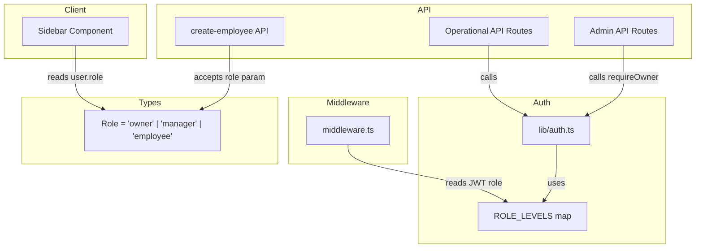

# Design Document: Manager Role

## Overview

This design introduces a "manager" role as a middle tier in FloorHub's role hierarchy: **owner > manager > employee**. The manager role grants access to operational features (delivery orders, commissions, installation jobs, returns, customers, inventory, leads, calendar, messages) without exposing administrative features (employees, expenses, contractors, reports, analytics, settings).

The change touches five layers of the application:
1. **Type system** — extend the `Role` union type
2. **Auth module** — add hierarchy-aware helpers (`requireManagerOrOwner`, `requireAtLeast`)
3. **Middleware** — add manager route allowlist
4. **Sidebar** — add a `managerNav` array
5. **API routes** — swap `requireOwner` for `requireManagerOrOwner` on operational endpoints
6. **Employee creation** — accept an optional `role` field

No database migration is needed because the `role` column is stored as `TEXT` with no `CHECK` constraint.

## Architecture



### Role Hierarchy

The hierarchy is encoded as a numeric level map:

| Role     | Level |
|----------|-------|
| owner    | 3     |
| manager  | 2     |
| employee | 1     |

Authorization checks compare the user's level against the required minimum level.

## Components and Interfaces

### 1. Type System (`types/index.ts`)

```typescript
export type Role = 'owner' | 'manager' | 'employee'
```

No changes to `JWTPayload` or `User` interfaces — they already reference the `Role` type.

### 2. Auth Module (`lib/auth.ts`)

New exports:

```typescript
const ROLE_LEVELS: Record<Role, number> = {
  owner: 3,
  manager: 2,
  employee: 1,
}

export function requireManagerOrOwner(user: JWTPayload): void {
  if (user.role === 'employee') {
    throw new ForbiddenError('Manager or owner access required')
  }
}

export function requireAtLeast(user: JWTPayload, minimumRole: Role): void {
  if (ROLE_LEVELS[user.role] < ROLE_LEVELS[minimumRole]) {
    throw new ForbiddenError(`${minimumRole} or higher access required`)
  }
}
```

`requireOwner` remains unchanged — it continues to check `user.role !== 'owner'`.

### 3. Sidebar Component (`components/layout/Sidebar.tsx`)

A new `managerNav` array is added:

```typescript
const managerNav = [
  { href: '/', label: 'Dashboard', icon: LayoutDashboard },
  { href: '/invoices', label: 'Invoices', icon: FileText },
  { href: '/customers', label: 'Customers', icon: Users },
  { href: '/inventory', label: 'Inventory', icon: Package },
  { href: '/leads', label: 'Leads', icon: Target },
  { href: '/commissions', label: 'Commissions', icon: TrendingUp },
  { href: '/installation-jobs', label: 'Installation Jobs', icon: Wrench },
  { href: '/delivery-orders', label: 'Delivery Orders', icon: Truck },
  { href: '/calendar', label: 'Calendar', icon: CalendarDays },
  { href: '/returns', label: 'Returns', icon: RotateCcw },
  { href: '/messages', label: 'Messages', icon: MessageSquare },
]
```

The nav selection logic becomes:

```typescript
const nav = user.role === 'owner' ? ownerNav : user.role === 'manager' ? managerNav : employeeNav
```

The existing `<p className="text-xs text-muted-foreground capitalize">{user.role}</p>` already handles displaying "manager" since it uses `capitalize`.

### 4. Middleware (`middleware.ts`)

Add a manager route allowlist between the employee check and the default pass-through:

```typescript
if (role === 'manager') {
  const managerAllowed = [
    '/', '/invoices', '/customers', '/inventory', '/leads',
    '/commissions', '/installation-jobs', '/delivery-orders',
    '/calendar', '/returns', '/messages'
  ]
  const allowed = managerAllowed.some(
    route => pathname === route || pathname.startsWith(route + '/')
  )
  if (!allowed) {
    return NextResponse.redirect(new URL('/', request.url))
  }
}
```

Managers are redirected to `/` (dashboard) when accessing restricted routes. Employees continue to be redirected to `/invoices`.

### 5. API Route Changes

Endpoints that currently use `requireOwner` but should allow managers:

| Endpoint | Current Guard | New Guard | Operations |
|----------|--------------|-----------|------------|
| `delivery-orders/[id]` | `requireOwner` | `requireManagerOrOwner` | PUT, DELETE |
| `installation-jobs/[id]` | `requireOwner` | `requireManagerOrOwner` | PUT, DELETE |
| `returns/[id]` | `requireOwner` | `requireManagerOrOwner` | PUT, DELETE |
| `customers/[id]` | `requireOwner` (DELETE) | `requireManagerOrOwner` | DELETE |
| `leads/[id]` | `requireOwner` (DELETE) | `requireManagerOrOwner` | DELETE |
| `products/[id]` | `requireOwner` (DELETE) | `requireManagerOrOwner` | DELETE |

Endpoints that remain `requireOwner` only:
- `users/*` (employee management)
- `settings/*`
- `expenses/*`
- `reports/*`
- `store/export`, `store/import`
- `quickbooks/*`

### 6. Create Employee API (`app/api/users/create-employee/route.ts`)

Accept an optional `role` field from the request body:

```typescript
const { name, email, password, role = 'employee' } = body
if (role !== 'employee' && role !== 'manager') {
  throw new ValidationError('Role must be "employee" or "manager"')
}
```

The SQL insert uses the provided role instead of hardcoded `'employee'`.

## Data Models

### Role Type

```typescript
type Role = 'owner' | 'manager' | 'employee'
```

### Role Levels (runtime constant)

```typescript
const ROLE_LEVELS: Record<Role, number> = {
  owner: 3,
  manager: 2,
  employee: 1,
}
```

### Database

No schema migration required. The `users.role` column is `TEXT` type with no `CHECK` constraint, so `'manager'` is already a valid value. The default remains `'employee'`.

### JWT Payload

No structural change. The `role` field in the JWT payload will carry `'manager'` for manager users. Existing tokens with `'owner'` or `'employee'` remain valid.


## Correctness Properties

*A property is a characteristic or behavior that should hold true across all valid executions of a system — essentially, a formal statement about what the system should do. Properties serve as the bridge between human-readable specifications and machine-verifiable correctness guarantees.*

### Property 1: Manager middleware route access

*For any* route path, a user with the "manager" role should be allowed access if and only if the route is in the manager allowlist (`/`, `/invoices`, `/customers`, `/inventory`, `/leads`, `/commissions`, `/installation-jobs`, `/delivery-orders`, `/calendar`, `/returns`, `/messages`). For any route not in the allowlist, the middleware should redirect to `/`.

**Validates: Requirements 3.1, 3.2, 3.4**

### Property 2: Employee middleware route access unchanged

*For any* route path, a user with the "employee" role should be allowed access if and only if the route is in the employee allowlist (`/invoices`, `/commissions`, `/leads`, `/messages`, `/calendar`). For any route not in the allowlist, the middleware should redirect to `/invoices`.

**Validates: Requirements 3.3**

### Property 3: requireOwner rejects non-owners

*For any* user whose role is not "owner" (i.e., "manager" or "employee"), calling `requireOwner` should throw a `ForbiddenError`.

**Validates: Requirements 4.1, 7.3**

### Property 4: requireManagerOrOwner access control

*For any* user, calling `requireManagerOrOwner` should succeed if the user's role is "manager" or "owner", and should throw a `ForbiddenError` if the user's role is "employee".

**Validates: Requirements 4.2**

### Property 5: requireAtLeast respects role hierarchy

*For any* user role and any minimum required role, `requireAtLeast(user, minimumRole)` should grant access if and only if `ROLE_LEVELS[user.role] >= ROLE_LEVELS[minimumRole]`.

**Validates: Requirements 4.5, 7.2**

### Property 6: Role hierarchy ordering invariant

*For any* pair of roles, the ROLE_LEVELS map should satisfy: `ROLE_LEVELS['owner'] > ROLE_LEVELS['manager'] > ROLE_LEVELS['employee']`.

**Validates: Requirements 7.1**

### Property 7: Create-employee role round-trip

*For any* valid role value ("employee" or "manager"), when an owner creates a user with that role, reading the user back from the database should return the same role value.

**Validates: Requirements 5.3**

### Property 8: Non-owner cannot create employees

*For any* user whose role is "manager" or "employee", calling the create-employee API should be rejected with a 403 Forbidden response.

**Validates: Requirements 5.4**

## Error Handling

| Scenario | Response | HTTP Status |
|----------|----------|-------------|
| Manager accesses owner-only API route | `{ error: "Owner access required" }` | 403 |
| Employee accesses manager-level API route | `{ error: "Manager or owner access required" }` | 403 |
| `requireAtLeast` fails | `{ error: "{role} or higher access required" }` | 403 |
| Manager navigates to restricted page | Redirect to `/` (dashboard) | 302 |
| Employee navigates to restricted page | Redirect to `/invoices` | 302 |
| Invalid role in create-employee body | `{ error: "Role must be \"employee\" or \"manager\"" }` | 400 |
| Non-owner calls create-employee | `{ error: "Owner access required" }` | 403 |

All error responses follow the existing `{ error: string }` JSON format. The `ForbiddenError` class in `lib/auth.ts` is reused for all authorization failures.

## Testing Strategy

### Unit Tests

Unit tests cover specific examples and edge cases:

- Verify the `Role` type includes exactly `'owner' | 'manager' | 'employee'`
- Verify `managerNav` contains exactly the 11 expected tabs
- Verify `managerNav` does not contain any admin tabs (Employees, Expenses, Contractors, Reports, Analytics, Settings)
- Verify `employeeNav` is unchanged
- Verify the sidebar renders the correct nav for each role
- Verify the sidebar displays "manager" as the role label
- Verify create-employee defaults to "employee" when no role is specified
- Verify create-employee rejects invalid role values (e.g., "owner", "admin", "superuser")
- Verify manager can read operational API endpoints (delivery-orders, returns, etc.)
- Verify manager can write to delivery-orders, installation-jobs, returns endpoints

### Property-Based Tests

Property-based tests use `fast-check` (the standard PBT library for TypeScript/JavaScript) with a minimum of 100 iterations per property.

Each property test is tagged with a comment referencing the design property:

```
// Feature: manager-role, Property 1: Manager middleware route access
```

Properties to implement:

1. **Manager middleware route access** — generate random route paths (from both allowed and disallowed sets) and verify the middleware decision matches the allowlist
2. **Employee middleware route access unchanged** — generate random route paths and verify employee access matches the existing allowlist
3. **requireOwner rejects non-owners** — generate random users with roles from `['owner', 'manager', 'employee']` and verify requireOwner passes only for owner
4. **requireManagerOrOwner access control** — generate random users and verify the function passes for manager/owner, rejects employee
5. **requireAtLeast respects role hierarchy** — generate all combinations of (user role, minimum role) and verify access matches level comparison
6. **Role hierarchy ordering invariant** — verify the strict ordering of ROLE_LEVELS values
7. **Create-employee role round-trip** — generate random valid role values and verify the stored role matches
8. **Non-owner cannot create employees** — generate users with non-owner roles and verify rejection
