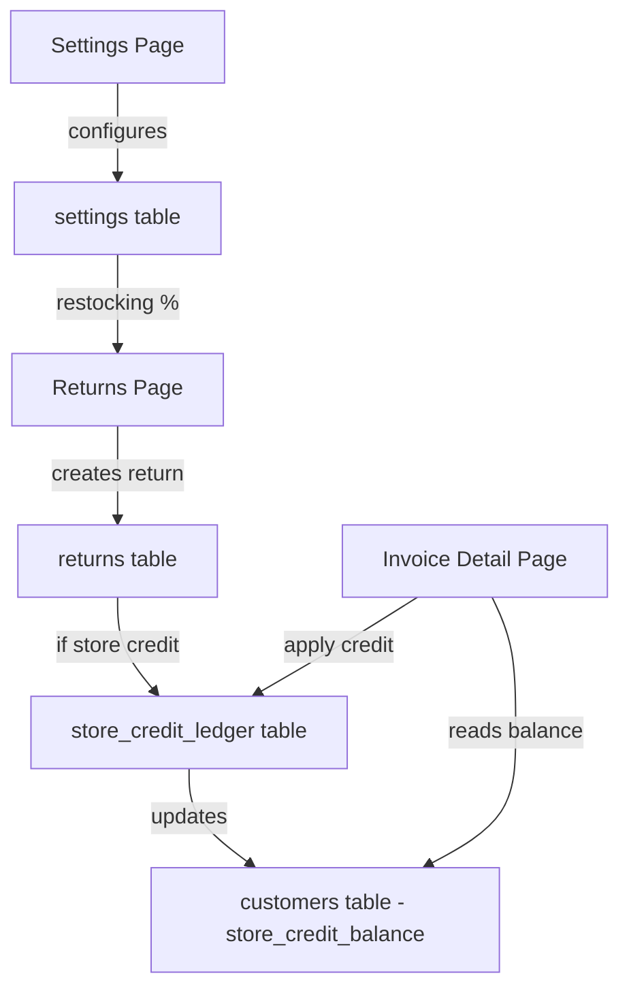

# Design Document: Store Credit

## Overview

This feature extends FloorHub's returns and invoicing system with store credit capabilities. It introduces four interconnected changes:

1. The hardcoded 20% restocking fee becomes a configurable percentage in Settings.
2. Store owners can waive the restocking fee on individual returns.
3. Return refunds can be issued as store credit instead of original payment method.
4. Store credit is tracked per customer, automatically surfaced during invoice payments, and recorded in a full audit ledger.

The design follows the existing FloorHub patterns: Next.js API routes with PostgreSQL via the `sql` tagged template, React client components with shadcn/ui, and the single `settings` row for global configuration.

## Architecture

The feature touches three existing subsystems and introduces one new data entity:



### Key Architectural Decisions

- Store credit balance is denormalized onto the `customers` table for fast reads. The `store_credit_ledger` table is the source of truth; the balance column is a cached aggregate.
- The ledger uses a simple credit/debit model with reference type and ID for traceability back to returns or invoices.
- Store credit application happens during the manual payment flow (not during online Stripe/Square payments) since store credit is an internal accounting concept.
- Restocking charge percentage is stored in the `settings` table alongside other global config, following the existing single-row pattern.

## Components and Interfaces

### API Routes (New / Modified)

#### `GET /api/settings` and `PUT /api/settings` (Modified)
- Add `restocking_charge_percentage` field (NUMERIC, default 20).
- Settings GET returns the value; PUT accepts and persists it.

#### `POST /api/returns` (Modified)
- Accept new fields: `refund_method` ("original_payment" | "store_credit"), `waive_restocking` (boolean).
- When `waive_restocking` is true, set restocking fee to 0.
- When `refund_method` is "store_credit", create a ledger entry and update customer balance.
- Read restocking percentage from settings instead of hardcoded 0.20.

#### `GET /api/customers/[id]/store-credit` (New)
- Returns the customer's `store_credit_balance` and ledger history.

#### `POST /api/invoices/[id]/apply-store-credit` (New)
- Accepts `{ amount }` — the store credit amount to apply.
- Validates amount ≤ customer balance and amount ≤ invoice outstanding.
- Creates a debit ledger entry, decreases customer balance, and records a manual payment.
- If the invoice is fully paid, marks it as paid and triggers commission calculation.

### UI Components (Modified)

#### Settings Page
- New "Restocking Charge (%)" input in the Company Information card, between existing fields.

#### Returns Page — New Return Dialog
- New "Waive Restocking Fee" checkbox below the totals summary.
- New "Refund Method" select (Original Payment / Store Credit) above the submit button.
- Totals recalculate live when waiver checkbox or restocking percentage changes.

#### Invoice Detail Page — Payment Section
- When customer has positive store credit, show an info banner with available balance.
- "Apply Store Credit" button opens a confirmation with the amount to apply (min of balance, outstanding).
- After applying, refresh payments list and invoice status.

#### Customers Page
- Display `store_credit_balance` as a column in the customer table (when > 0).
- In the customer edit dialog or a detail view, show the ledger history.

## Data Models

### Schema Changes

#### `settings` table — new column
```sql
ALTER TABLE settings ADD COLUMN IF NOT EXISTS restocking_charge_percentage NUMERIC(5,2) NOT NULL DEFAULT 20.00;
```

#### `customers` table — new column
```sql
ALTER TABLE customers ADD COLUMN IF NOT EXISTS store_credit_balance NUMERIC(10,2) NOT NULL DEFAULT 0.00;
```

#### `returns` table — new columns
```sql
ALTER TABLE returns ADD COLUMN IF NOT EXISTS refund_method TEXT NOT NULL DEFAULT 'original_payment';
ALTER TABLE returns ADD COLUMN IF NOT EXISTS waive_restocking BOOLEAN NOT NULL DEFAULT FALSE;
```

#### `store_credit_ledger` table (new)
```sql
CREATE TABLE IF NOT EXISTS store_credit_ledger (
  id TEXT PRIMARY KEY,
  customer_id TEXT NOT NULL REFERENCES customers(id) ON DELETE CASCADE,
  transaction_type TEXT NOT NULL CHECK (transaction_type IN ('credit', 'debit')),
  amount NUMERIC(10,2) NOT NULL CHECK (amount > 0),
  reference_type TEXT NOT NULL CHECK (reference_type IN ('return', 'invoice')),
  reference_id TEXT NOT NULL,
  description TEXT DEFAULT '',
  created_at TIMESTAMPTZ NOT NULL DEFAULT NOW()
);
CREATE INDEX IF NOT EXISTS store_credit_ledger_customer_idx ON store_credit_ledger(customer_id);
```

### TypeScript Types (additions to `types/index.ts`)

```typescript
export type RefundMethod = 'original_payment' | 'store_credit'
export type StoreCreditTransactionType = 'credit' | 'debit'
export type StoreCreditReferenceType = 'return' | 'invoice'

export interface StoreCreditLedgerEntry {
  id: string
  customer_id: string
  transaction_type: StoreCreditTransactionType
  amount: number
  reference_type: StoreCreditReferenceType
  reference_id: string
  description: string
  created_at: string
}
```

### Settings Type Update
```typescript
export interface Settings {
  // ... existing fields ...
  restocking_charge_percentage: number
}
```


## Correctness Properties

*A property is a characteristic or behavior that should hold true across all valid executions of a system — essentially, a formal statement about what the system should do. Properties serve as the bridge between human-readable specifications and machine-verifiable correctness guarantees.*

### Property 1: Settings restocking percentage round-trip

*For any* numeric value V in [0, 100], saving V as the restocking charge percentage via the settings API and then reading it back should return V.

**Validates: Requirements 1.2**

### Property 2: Restocking percentage validation

*For any* numeric value V, the system should accept V as a restocking charge percentage if and only if 0 ≤ V ≤ 100.

**Validates: Requirements 1.4**

### Property 3: Restocking fee calculation with waiver

*For any* return with refund amount R and configured restocking percentage P: if `waive_restocking` is true, the restocking fee should be 0 and net refund should equal R; if `waive_restocking` is false, the restocking fee should equal R × P / 100 (rounded to 2 decimal places) and net refund should equal R minus the restocking fee.

**Validates: Requirements 1.5, 2.2, 2.3, 2.5**

### Property 4: Return record field persistence

*For any* return created with a given `refund_method` and `waive_restocking` value, reading the return record back should contain those exact field values.

**Validates: Requirements 2.4, 3.4**

### Property 5: Store credit issuance creates correct ledger entry

*For any* return with `refund_method` = "store_credit", the system should create exactly one `store_credit_ledger` entry with `transaction_type` = "credit", `amount` equal to the net refund, `reference_type` = "return", `reference_id` equal to the return ID, and `customer_id` equal to the invoice's customer.

**Validates: Requirements 3.2, 3.5, 6.2, 6.3**

### Property 6: Original payment creates no ledger entry

*For any* return with `refund_method` = "original_payment", the system should not create any `store_credit_ledger` entry referencing that return.

**Validates: Requirements 3.3**

### Property 7: Balance non-negativity invariant

*For any* customer at any point in time, the `store_credit_balance` value should be greater than or equal to zero.

**Validates: Requirements 4.4**

### Property 8: Store credit application deducts correct amount

*For any* customer with store credit balance B and invoice with outstanding amount O, applying store credit should deduct exactly min(B, O) from the customer's balance.

**Validates: Requirements 5.3**

### Property 9: Store credit redemption creates correct ledger entry

*For any* store credit application against an invoice, the system should create exactly one `store_credit_ledger` entry with `transaction_type` = "debit", `amount` equal to the applied amount, `reference_type` = "invoice", and `reference_id` equal to the invoice ID.

**Validates: Requirements 5.4, 6.4**

### Property 10: Invoice status after store credit application

*For any* invoice with outstanding amount O and store credit application of amount A: if A ≥ O, the invoice status should become "paid"; if A < O, the invoice should remain unpaid with the outstanding balance reduced by A.

**Validates: Requirements 5.5, 5.6**

### Property 11: Ledger consistency invariant

*For any* customer, the sum of all `store_credit_ledger` entries with `transaction_type` = "credit" minus the sum of all entries with `transaction_type` = "debit" should equal the customer's current `store_credit_balance`.

**Validates: Requirements 4.2, 4.3, 6.6**

## Error Handling

| Scenario | Handling |
|---|---|
| Restocking percentage out of range (< 0 or > 100) | API returns 400 with validation error; UI input uses `min=0 max=100` |
| Store credit application exceeds customer balance | API returns 400; amount is capped at available balance on the client |
| Store credit application exceeds invoice outstanding | API returns 400; amount is capped at outstanding on the client |
| Customer not found when applying store credit | API returns 404 |
| Invoice not found or not in payable status | API returns 400/404 |
| Concurrent store credit operations (race condition) | Use a database transaction with `SELECT ... FOR UPDATE` on the customer row to serialize balance updates |
| Return created for invoice without a customer_id | API returns 400 — customer must exist to track store credit |
| Ledger/balance inconsistency detected | Log error; admin can reconcile by recalculating balance from ledger entries |

## Testing Strategy

### Unit Tests
- Settings API: default restocking percentage value, save and retrieve, validation boundaries (0, 100, negative, > 100).
- Returns API: return creation with waiver on/off, return creation with each refund method, restocking fee calculation edge cases (0% rate, 100% rate).
- Store credit application: apply full balance, apply partial balance, apply to fully paid invoice (should reject), apply when balance is 0 (should reject).
- Ledger: verify entry creation for credit and debit, verify no entry for original_payment refunds.

### Property-Based Tests
- Use `fast-check` as the property-based testing library (already standard for TypeScript/JavaScript projects).
- Each property test runs a minimum of 100 iterations.
- Each test is tagged with a comment referencing the design property:
  - **Feature: store-credit, Property 1: Settings restocking percentage round-trip**
  - **Feature: store-credit, Property 2: Restocking percentage validation**
  - **Feature: store-credit, Property 3: Restocking fee calculation with waiver**
  - **Feature: store-credit, Property 4: Return record field persistence**
  - **Feature: store-credit, Property 5: Store credit issuance creates correct ledger entry**
  - **Feature: store-credit, Property 6: Original payment creates no ledger entry**
  - **Feature: store-credit, Property 7: Balance non-negativity invariant**
  - **Feature: store-credit, Property 8: Store credit application deducts correct amount**
  - **Feature: store-credit, Property 9: Store credit redemption creates correct ledger entry**
  - **Feature: store-credit, Property 10: Invoice status after store credit application**
  - **Feature: store-credit, Property 11: Ledger consistency invariant**
- Each correctness property is implemented by a single property-based test.
- Property tests focus on the business logic functions (restocking fee calculation, balance update logic, ledger entry creation) extracted into pure utility functions for testability.
- Unit tests complement property tests by covering specific edge cases, integration points (API route handlers), and UI rendering checks.
